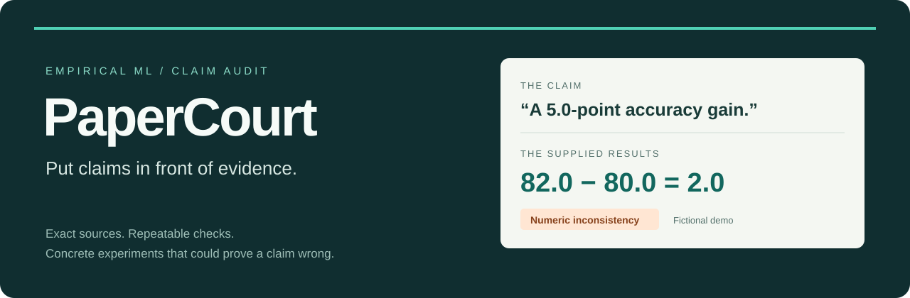

<p align="center">
  
</p>

<p align="center">
  <a href="https://github.com/K-kiron/PaperCourt/actions/workflows/test.yml"></a>
  <a href="LICENSE"></a>
  <a href="https://github.com/K-kiron/PaperCourt/releases"></a>
</p>

# PaperCourt

**An agent skill that traces empirical ML paper claims to inspectable evidence.**

Give it Markdown, LaTeX, or extracted text plus CSV/JSON results. Get a report
linking each claim to exact sources, repeatable checks, limitations, and a
concrete experiment that could challenge it. Script checks and model analysis
stay visibly separate. Missing evidence stays **unknown**.

[See the report](demo/report.md) · [Install](#install) · [Try the demo](#try-the-demo) · [Case format](skills/papercourt/references/case-format.md) · [Releases](https://github.com/K-kiron/PaperCourt/releases)

## What an audit catches

The abstract claims improvement everywhere. The evidence covers one dataset
and one budget. PaperCourt makes that gap inspectable and proposes a controlled
boundary test rather than a generic request for more experiments.

| Claim in the example | Evidence check | Assessment |
| --- | --- | --- |
| 82.0% accuracy in the stated setting | The supplied aggregate is 82.0 | Supported within scope |
| A 5.0 percentage-point gain | 82.0 − 80.0 = **2.0** | Conflicting evidence |
| 2.0× faster on identical hardware | 20 / 10 = 2.0; **CPU and GPU differ** | Comparison is limited |
| Improvement across all datasets and budgets | Only one of each is supplied | Scope exceeds evidence |
| Robustness under distribution shift | No shift result supplied | **Unknown**, not false |
| A 2.5% relative gain | 100 × (82 − 80) / 80 = **2.5%** | Supported within scope |

The example is original, fictional MIT-licensed teaching material. Its numbers
do not describe a real experiment or establish better review quality.

## Install

From your paper project's directory, install with the
[open skills CLI](https://github.com/vercel-labs/skills):

```sh
npx skills@1.7.0 add K-kiron/PaperCourt --skill papercourt --agent codex
```

This targets the current project. The helper requires **Python 3.10+** and uses
only the standard library. The CLI installer requires Node.js and network
access; running an existing case requires neither.

Alternatively, clone or download this repository and use the Python installer:

```sh
git clone https://github.com/K-kiron/PaperCourt.git
cd PaperCourt
python tools/install_skill.py --project "/path/to/paper-project"
```

On Windows, use a path such as `"C:/Research/my-paper"`. The Python installer
copies the self-contained skill into `<project>/.agents/skills/papercourt` and
refuses to overwrite an existing installation. It changes no global settings.
The [standalone skill ZIP](https://github.com/K-kiron/PaperCourt/releases/latest)
can also be extracted into that project's `.agents/skills/` directory.

Open the paper project in Codex and invoke:

```text
Use $papercourt to audit paper.md against results.csv and runtime.json.
Focus on the abstract's main empirical claims. Create a linked evidence
report with minimal falsifying checks in a local review directory.
```

Codex project discovery and a skill-guided workflow were verified on Windows.
See [validation](docs/validation.md) for exact versions and scope. Other agent
hosts and automatic skill selection have not been validated. You can use the
Python helper directly without an agent host.

## Try the demo

From this repository, run:

```sh
python skills/papercourt/scripts/papercourt.py audit examples/tiny-ml/case.json --out output/first-review
```

Open `output/first-review/report.html`. Click an evidence link to jump to its
highlighted source line. No server or external assets are needed.

| Output | Purpose |
| --- | --- |
| `report.html` | Standalone, clickable evidence report |
| `report.md` + `evidence/` | Review in a repository or Markdown viewer |
| `report.json` | Structured results for downstream tools |
| `inputs/` | Byte-preserved case and sources for independent replay |

The [checked-in report](demo/report.md) is browsable on GitHub. Download the
[HTML report](demo/report.html) to view it locally. The prepared case replays a
worked review; it does not perform fresh model analysis.

## How it works

1. **The skill maps the claims.** The host reads the supplied material, selects
   important claims, and records exact quotes and source locations.
2. **The helper recomputes the numbers.** Values, differences, ratios, relative
   changes, and unweighted means are checked with explicit decimal tolerances.
   Selected comparison controls are aligned, different, or unknown.
3. **The report preserves the evidence.** Each model assessment states its
   limitations and proposes a small next check with an observable falsifier.
   Hashes and original inputs make the report replayable.

Numeric mappings, units, tolerance choices, semantic assessments, and proposed
experiments still need human review. Matching metadata does not prove that a
comparison is fair or that a result is statistically significant.

For your own material, use the [case format](skills/papercourt/references/case-format.md).
Output directories must be new. Exit `0` means the report was created, not that
all claims are supported. `--fail-on-inconsistency` returns `1` for numeric
discrepancies or differing selected conditions. Invalid input returns `2`.

## Scope and privacy

PaperCourt targets empirical ML papers with locatable text and structured
results. It does not parse arbitrary PDFs, resolve LaTeX includes, verify the
literature, execute paper code, run experiments, or issue academic verdicts.
JSON references identify a record pointer within a whole-file snapshot.

The helper makes no network requests. **A hosted agent still processes supplied
text under that host's data policy.** The skill does not authorize additional
uploads or publication. Reports copy every declared source file; inspect them
before sharing. No improvement in review accuracy or time savings has been
established by the initial example.

## Development and contributions

```sh
python -m unittest discover -s tests -v
python tools/check_repository.py
```

Tests cover actual files, failure cases, source replay, installation, and report
links. CI runs on Windows and Linux with Python 3.10 and 3.12. Read
[CONTRIBUTING.md](CONTRIBUTING.md) for examples, verification, and release builds;
see [SECURITY.md](SECURITY.md) for safe reporting and [CHANGELOG.md](CHANGELOG.md)
for release history.

The repository presentation and distribution conventions were informed by
[Anthropic Skills](https://github.com/anthropics/skills),
[OpenAI Skills](https://github.com/openai/skills), and
[Vercel Agent Skills](https://github.com/vercel-labs/agent-skills). The related
[verify-claims workflow](https://github.com/ShaishavMaisuria/research-paper-lifecycle-skills/blob/main/skills/verify-claims/SKILL.md)
also addresses paper claim review. PaperCourt's implementation, instructions,
and examples are original; no upstream code or skill prose is copied.

[MIT licensed](LICENSE), including the fictional examples.
